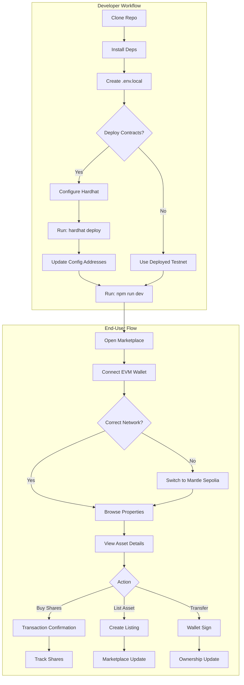

<div align="center">

  <h1>🏠 MantleRWA Marketplace</h1>
  
  <p><strong>A decentralized marketplace for tokenized Real-World Assets (RWA) with fractional ownership on Mantle Network.</strong></p>
  
  <p><strong>🚀 Built on Mantle - the high-performance Ethereum Layer 2 (L2) blockchain optimized for real-world asset tokenization.</strong></p>
  
  <p>
    <a href="https://nextjs.org/" target="_blank"></a>
    <a href="https://www.typescriptlang.org/" target="_blank"></a>
    <a href="https://chakra-ui.com/" target="_blank"></a>
    <a href="https://soliditylang.org/" target="_blank"></a>
    <a href="https://mantle.xyz/" target="_blank"></a>
    <a href="https://rainbowkit.com/" target="_blank"></a>
  </p>
</div>

---

## Table of Contents

- [Features](#features)
- [Tech Stack](#tech-stack)
- [Requirements](#requirements)
- [Getting Started](#getting-started)
- [Project Structure](#project-structure)
- [Smart Contracts](#smart-contracts)
- [Environment](#environment)
- [Workflow](#workflow)
- [Troubleshooting](#troubleshooting)
- [License](#license)

---

## ✨ Features

### 🎨 **Professional UI/UX**
- **Modern Design**: Gradient backgrounds, glassmorphism, and professional layouts using Chakra UI.
- **Smooth Animations**: Powered by Framer Motion for high-end micro-interactions.
- **Responsive**: Optimized for desktop, tablet, and mobile devices.
- **Enhanced Dashboard**: Real-time portfolio analytics with interactive metrics.

### 🛒 **RWA Marketplace**
- **Fractional Ownership**: Standardized share system built directly into the property smart contract.
- **Buy/Transfer Interface**: Seamlessly buy shares or transfer them to other wallet addresses.
- **Real-time Pricing**: Dynamic price calculations and instant MNT cost display.
- **Investment Tracking**: Real-time portfolio updates with on-chain verification.

### 💳 **EVM Wallet Integration**
- **RainbowKit & Wagmi**: Native support for MetaMask, Coinbase Wallet, Rainbow, and more.
- **Seamless Connection**: One-click wallet connection with automatic Mantle network detection.
- **Secure Transactions**: All operations required user approval via standard EIP-712 or standard signing.

### 🔒 **Security & Production Ready**
- **Hardhat Tested**: Comprehensive test suite for fractionalization and trading logic.
- **Secure Logging**: Production-safe logging system that sanitizes sensitive data.
- **Verified Contracts**: Designed for Mantle Network deployment with standard OpenZeppelin security.

---

## 🏗️ Workflow & Architecture

### **Property NFT Creation → Fractionalization → Listing Flow**

```mermaid
flowchart TD
    Start[Start: Real-World Asset] --> Create[1. Create Property NFT]
    
    Create --> CreateDetails[Property Details:<br/>- Name & Description<br/>- Location & Type<br/>- Total Value<br/>- Total Shares<br/>- Price per Share MNT<br/>- Rental Yield]
    
    Create --> Mint[2. Mint Property NFT]
    Mint --> MintTx[Transaction on Mantle<br/>Solidity: createProperty]
    
    MintTx --> Fractional[3. Automatic Fractionalization]
    Fractional --> FracDetails[Fractional Shares:<br/>- Total Shares: 10,000<br/>- Available: 10,000<br/>- Price: 1 MNT/share<br/>- Stored in Solidity Contract]
    
    FracDetails --> List[4. Auto-Listed in Marketplace]
    List --> ListDetails[Marketplace Listing:<br/>- Visible to all users<br/>- Real-time availability<br/>- Instant investment ready]
    
    ListDetails --> Invest[5. Users Can Invest]
    Invest --> InvestOptions{Investment Options}
    
    InvestOptions --> BuyShares[Buy Fractional Shares]
    BuyShares --> ShareDetails[Purchase Details:<br/>- Min: 1 share<br/>- Max: Available shares<br/>- Payment in MNT<br/>- Gas: Minimal MNT]
    
    ShareDetails --> InvestUpdate[Share Balance Updated]
    InvestUpdate --> InvestRecord[Investment Record:<br/>- Property ID<br/>- Shares Owned<br/>- Investment Amount<br/>- Timestamp]
    
    InvestRecord --> Portfolio[6. Track in Portfolio]
    Portfolio --> PortfolioView[My Investments Page:<br/>- Total Invested<br/>- Total Shares<br/>- Properties Owned<br/>- Real-time Updates]
    
    PortfolioView --> Transfer[7. Transfer Shares Optional]
    Transfer --> TransferTx[Transfer Shares<br/>to Another Address]
    
    TransferTx --> End[End: Complete Ownership Cycle]
    
    style Create fill:#9f7aea,stroke:#805ad5,color:#fff
    style Fractional fill:#38b2ac,stroke:#319795,color:#fff
    style List fill:#ed8936,stroke:#dd6b20,color:#fff
    style Invest fill:#48bb78,stroke:#38a169,color:#fff
    style Portfolio fill:#4299e1,stroke:#3182ce,color:#fff
```



### **Technical Implementation Architecture**

```mermaid
flowchart LR
    subgraph Creation[Asset Creation]
        A[User Input] --> B[CreatePropertyForm]
        B --> C[propertyContract.createProperty]
        C --> D[Solidity: createProperty]
        D --> E[On-Chain State]
    end
    
    subgraph Fractionalization[EVM Fractionalization]
        E --> F[Total Shares]
        F --> G[Available Shares]
        G --> H[Price per Share]
        H --> I[ERC721 Metadata]
    end
    
    subgraph Listing[Marketplace]
        I --> J[fetchProperties]
        J --> K[Collection Page]
        K --> L[Display Cards]
        L --> M[Investment Modal]
    end
    
    subgraph Investment[Investment Flow]
        M --> N[User Input]
        N --> O[propertyContract.invest]
        O --> P[Solidity: invest function]
        P --> Q[Transfer MNT]
        Q --> R[Update mapping]
    end
    
    subgraph Portfolio[Portfolio Logic]
        R --> S[getUserInvestments]
        S --> T[My Investments Page]
        T --> U[Real-time Balance]
        U --> V[Transfer Option]
    end
    
    style Creation fill:#e6f7ff
    style Fractionalization fill:#f0f5ff
    style Listing fill:#fff7e6
    style Investment fill:#f6ffed
    style Portfolio fill:#fff0f6
```



### **Dev + User Flow**



---

## 🏗️ Smart Contracts (Solidity)

The platform is powered by the **PropertyNFT.sol** contract, an ERC721-based asset manager with built-in fractionalization.

### **Key Functions**
- `createProperty(...)`: Mint a new RWA property with metadata, shares, and price configuration.
- `invest(uint256 propertyId, uint256 shares)`: Invest in a property by paying MNT.
- `transferShares(uint256 propertyId, address to, uint256 shares)`: Transfer your fractional shares to another user.
- `distributeDividends(uint256 propertyId)`: Managers can distribute earnings to share holders.
- `claimDividends(uint256 propertyId)`: Investors can claim their share of property revenue.

---

## 🔗 Mantle Integration

### **Why Mantle for RWA?**
- **High Scalability**: Built on Ethereum L2 to handle high trading volumes with minimal lag.
- **Low Gas Fees**: Fractionalizing assets costs cents, not dollars.
- **EVM Compatibility**: Uses standard Ethereum tools (Hardhat, Ethers, EIPs).
- **Security**: Inherits Ethereum's security through Mantle's modular architecture.

### **Network Configuration (Mantle Sepolia)**
- **RPC URL**: `https://rpc.sepolia.mantle.xyz`
- **Chain ID**: `5003`
- **Native Token**: `MNT`
- **Explorer**: `https://sepolia.mantlescan.xyz`

---

## 🚀 Quick Start

### Prerequisites
- **Node.js 18+**
- **MetaMask** or any EVM wallet.
- **MNT Testnet Tokens**: Get them from the [Mantle Faucet](https://faucet.sepolia.mantle.xyz).

### Installation

1. **Clone the repository**
   ```bash
   git clone https://github.com/RWA-Exchange/RWA-Exchange-Mantle.git
   cd RWA-Exchange-Mantle
   ```

2. **Install dependencies**
   ```bash
   npm install
   ```

3. **Configure Environment**
   ```bash
   cp .env.example .env.local
   ```
   Update `.env.local` with your Mantle RPC and contract addresses.

4. **Deploy Contracts (Optional)**
   ```bash
   npx hardhat run scripts/deploy.ts --network mantle_testnet
   ```

5. **Run Frontend**
   ```bash
   npm run dev
   ```
   Open [http://localhost:3000](http://localhost:3000) to view the marketplace.

---

## 🛠️ Project Structure

- `contracts/` — Solidity smart contracts (`PropertyNFT.sol`).
- `scripts/` — Hardhat deployment and maintenance scripts.
- `tests/` — Hardhat unit and integration tests.
- `src/app/` — Next.js 16 App Router pages.
- `src/components/` — UI components and forms.
- `src/services/` — Blockchain interaction services (Ethers.js based).
- `src/config/` — Network and application configuration.

---

## 📜 Scripts

```bash
npm run dev           # Start Next.js dev server
npm run build         # Build production bundle (Next.js 16 + Webpack)
npm run lint          # Run Linter
npx hardhat compile   # Compile Solidity contracts
npx hardhat test      # Run smart contract tests
```

---

## ⚠️ Troubleshooting

### Wallet Issues
- **Wrong Network**: Ensure your wallet is set to **Mantle Sepolia** (Chain ID 5003).
- **Connection**: If connection fails, refresh the page and ensure the wallet is unlocked.
- **Gas Fees**: Ensure you have enough **MNT** for gas (~0.01 per tx).

### Build Errors
- **Module not found**: Delete `node_modules` and run `npm install --legacy-peer-deps`.
- **Next.js Version**: The project uses Next.js 16. Ensure you are using the correct Node.js version.

---

## 📜 License

MIT © RWA Exchange Contributors
